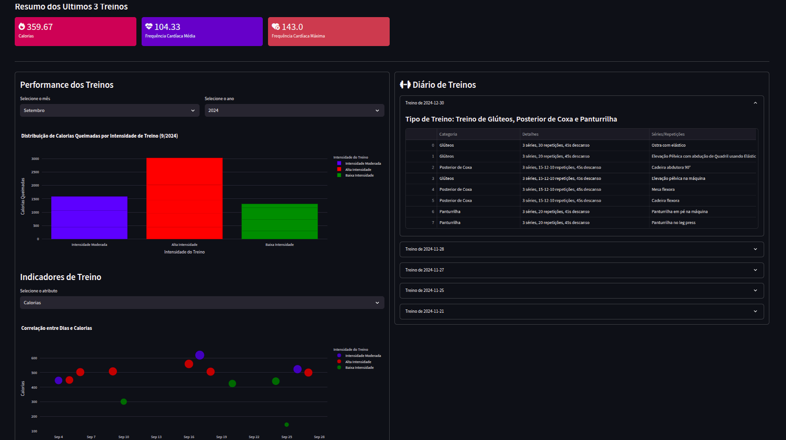

# Dashboard de Monitoramento de Treinos

## Descrição do Projeto
Projeto que visa a criação de um dashboard interativo para visualizar e analisar dados coletados do sensor **Polar Verity Sense**. A plataforma permite acompanhar métricas importantes dos treinos, incluindo:

- **Calorias Queimadas**
- **Frequência Cardíaca Média (HRV)**
- **Frequência Cardíaca Máxima**
- **Duração do Treino**
- **Nome dos Exercícios, Séries e Repetições**

Além disso, o projeto permite a análise detalhada dos treinos e a segmentação dos dados em diferentes padrões para melhor interpretação e acompanhamento do desempenho do usuário.


## Estrutura do Projeto

O repositório está organizado da seguinte forma:

```
POLARFLOWDATA/
│── Data/                      # Arquivos JSON com dados de perfil e treino
│   ├── bioData.json
│   ├── profile.json
│   ├── set.json
│
│── DataAcess/                 # Camada de acesso aos dados
│   ├── DataRequestPolar.py
│   ├── HealthData.py
│   ├── ReadTreino.py
│   ├── TrainingDataPolar.py
│   ├── UserProfile.py
│
│── DataAnalysis/              # Scripts para análise de dados
│   ├── CaloriasQueimadasBYDuracao.py
│   ├── CaloriasQueimadasPorDuracaoCluster.py
│   ├── DataLoader.py
│   ├── Descritiva.py
│   ├── DuracaoTreinoByData.py
│   ├── FrequenciaCardiacaComCalorias.py
│   ├── MatrizCorrelacao.py
│   ├── PlotAllVariableKmeans.py
│   ├── ProgressaoCaloriasPorTreino.py
│   ├── ProgressaoFCMPorTreino.py
│
│── Interface/                 # Interface gráfica e componentes visuais
│   ├── HealthDashboard.py
│   ├── MetricCard.py
│   ├── ProfileCard.py
```

## Tecnologias Utilizadas
- **Python** (principal linguagem do projeto)
- **Streamlit** (criação do dashboard interativo)
- **Plotly** (visualização de dados)
- **Pandas** (manipulação de dados)
- **Scikit-Learn** (análise estatística e clustering)

## Como Usar
1. Clone este repositório:
   ```sh
   git clone https://github.com/seuusuario/POLARFLOWDATA.git
   ```
2. Instale as dependências:
   ```sh
   pip install -r requirements.txt
   ```
3. Execute o dashboard:
   ```sh
   streamlit run Interface/HealthDashboard.py
   ```

## Trabalhos Futuros
Os próximos passos para o projeto incluem:
- Implementação de algoritmos de **predição de treinos** com base nos dados coletados.
- Melhoria na segmentação e visualização dos dados para maior personalização dos treinos.
- Integração com outros dispositivos de monitoramento para ampliar a base de dados.

## Licença
Este projeto é licenciado sob a **MIT License** - consulte o arquivo [LICENSE](LICENSE) para mais detalhes.

---

Desenvolvido por Elton Sarmanho 

Para mais informações ou parcerias, entre em contato: **eltonss@ufpa.br**
